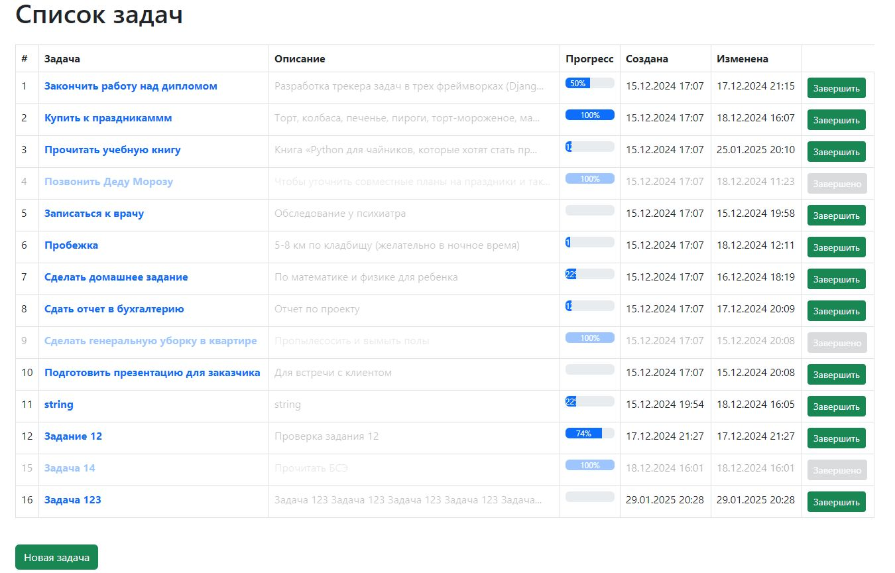
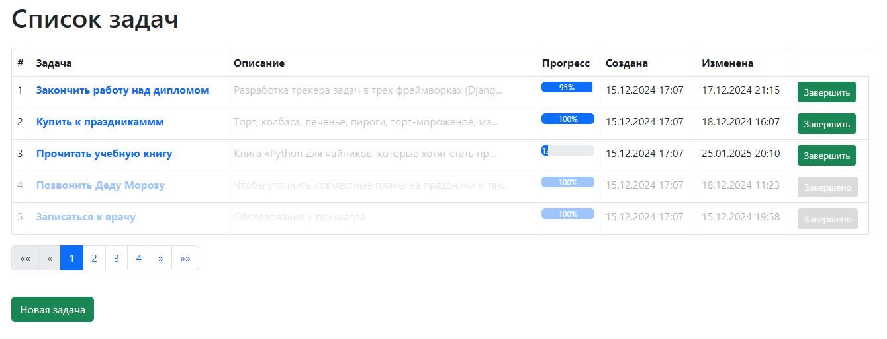

# TrackerFastAPI
## Описание головного проекта
Проект **TaskTracker** представляет собой приложение для управления задачами, реализованное с использованием трех популярных фреймворков Python: Django, FastAPI и Flask. Основная цель проекта — сравнение производительности, удобства использования и возможности каждого из этих фреймворков для разработки веб-приложений.
В проекте реализована базовая функциональность для отображения, создания, редактирования и удаления задач. Он демонстрирует особенности каждого фреймворка, включая работу с базой данных, аутентификацию пользователей и обработку запросов.

Приложение TaskTracker, представляет собой веб-приложение для управления задачами. Оно предоставляет пользователю возможность создавать, редактировать, удалять задачи, просматривать их список, а также изменять статус задачи на “завершено”.

Маршрут `@app.get("/",...` отображает основное окно программы:

без пагинации:

с пагинацией:

окно редактирования задачи

окно создания новой задачи

## Архитектура приложения
Общая структура приложения
Архитектура приложения следует модели MVC (Model-View-Controller):
1.	**Models** В файле models.py описана структура данных с помощью Tortoise ORM. Модель Task включает следующие поля:
o	id — первичный ключ.
o	title — название задачи.
o	description — описание задачи (опциональное).
o	status — статус задачи (“to_do”, “in_progress” или “done”).
o	progress — прогресс выполнения задачи (в процентах).
o	created_at — дата и время создания задачи.
o	updated_at — дата и время последнего обновления задачи.
2.	**Views** Представлены обработчиками маршрутов в файле `main.py`. Каждый маршрут соответствует определённому действию: просмотр списка задач, создание новой задачи, редактирование существующей или её удаление.
3.	**Controllers** Логика работы с данными выделена в отдельный файл `crud.py`. Здесь реализованы функции для взаимодействия с базой данных, такие как получение задач, создание, обновление и удаление.

## Технические особенности реализации
Приложение разработано с использованием асинхронного фреймворка **FastAPI**, который обеспечивает высокую производительность и удобство написания кода. Для работы с базой данных использовалась **Tortoise ORM**, а в качестве хранилища данных — SQLite. Шаблоны страниц создавались с использованием **Jinja2**, а статика может быть подключена через модуль **StaticFiles**.
Подключение к базе данных выполняется при старте приложения с помощью функции `Tortoise.init`. Также реализован механизм автоматической генерации схем таблиц базы данных.

### Основные маршруты приложения
•	GET /tasks — возвращает список всех задач. Данные рендерятся с использованием шаблона index.html.

•	POST /tasks/new — добавляет новую задачу. Для обработки данных формы используется метод Form.

•	GET /tasks/{task_id} — отображает детали конкретной задачи.

•	POST /tasks/{task_id}/edit — обновляет информацию о задаче, включая название, описание, статус и прогресс.

•	POST /tasks/{task_id}/complete — помечает задачу как завершённую, устанавливая статус “done” и прогресс на 100%.

•	POST /tasks/{task_id}/delete — удаляет задачу из базы данных.

### Логика работы с данными
Обработка CRUD-операций реализована через функции в файле crud.py:

get_tasks — возвращает список задач с возможностью пагинации.

create_task — создаёт новую задачу с заданными параметрами.

update_task — обновляет существующую задачу.

delete_task — удаляет задачу по идентификатору.

Все операции с базой данных выполняются асинхронно, что обеспечивает высокую производительность приложения при взаимодействии с большими объёмами данных

### Особенности интеграции Tortoise ORM
**Tortoise ORM** предоставляет удобный API для работы с базой данных, включая миграции, асинхронные запросы и поддержку аннотаций. Это позволило разделить логику работы с данными от представления, улучшив модульность и читаемость кода.
Таким образом, приложение TaskTracker на FastAPI представляет собой производительное и модульное решение для управления задачами, которое демонстрирует преимущества асинхронного подхода и гибкость FastAPI.

## Установка проекта
Для запуска проекта следуйте этим шагам:
1.	Клонируйте репозиторий:

`git clone https://github.com/Vivisector/TrackerFastAPI.git`
2.	Перейдите в папку с проектом:

`cd app`
3.	Создайте виртуальное окружение (если не использовалось ранее):

`python -m venv .venv`

`venv\Scripts\activate`

5. Установите зависимости:

`pip install -r requirements.txt`

## Для запуска проекта:

`uvicorn fastapi_app:app --reload`

Откройте в браузере http://127.0.0.1:8000/.

### Основной функционал проекта

•	API для управления задачами с использованием FastAPI.

•	Поддержка работы с базой данных с помощью Tortoise ORM.

•	Используется встроенная документация Swagger для тестирования API.

### Автор проекта
*Беляков Дмитрий*

